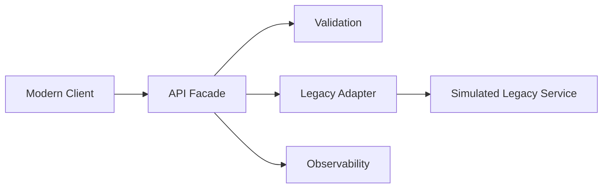

# API Modernization Platform

A reference implementation for modernizing a legacy transaction service behind a stable, cloud-ready API facade.

> Portfolio project demonstrating application modernization, API architecture, backward compatibility, observability, and incremental migration. The legacy service is simulated.

## Problem

Legacy applications expose tightly coupled interfaces and are difficult to evolve. A modernization program needs a safe seam where new consumers adopt modern APIs while the old system continues operating.

## Architecture



## Quick start

```bash
pip install -r requirements.txt
uvicorn app.main:app --reload
```

Swagger: `http://127.0.0.1:8000/docs`

```bash
curl -X POST http://127.0.0.1:8000/v1/accounts/transfer -H "Content-Type: application/json" -H "X-Correlation-ID: demo-123" -d "{"from_account":"10001","to_account":"20002","amount":250.00,"currency":"USD"}"
```

## Modernization strategy

The project demonstrates the **strangler pattern**: introduce a facade, keep legacy behavior behind an adapter, migrate capabilities one at a time, add observability, dual-run selected traffic, then retire legacy components.

## Highlights

- REST API and OpenAPI
- correlation IDs
- legacy adapter abstraction
- clean API/domain/infrastructure separation
- tests, Docker, GitHub Actions
- architecture and migration plan
- ADRs
